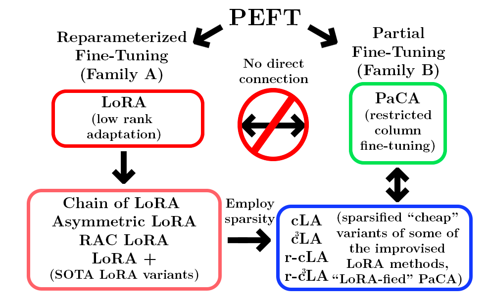
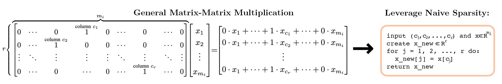
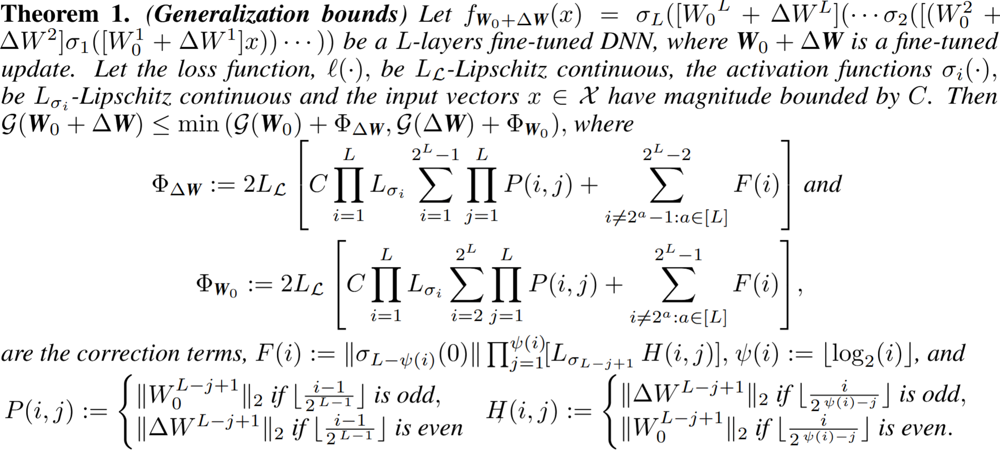
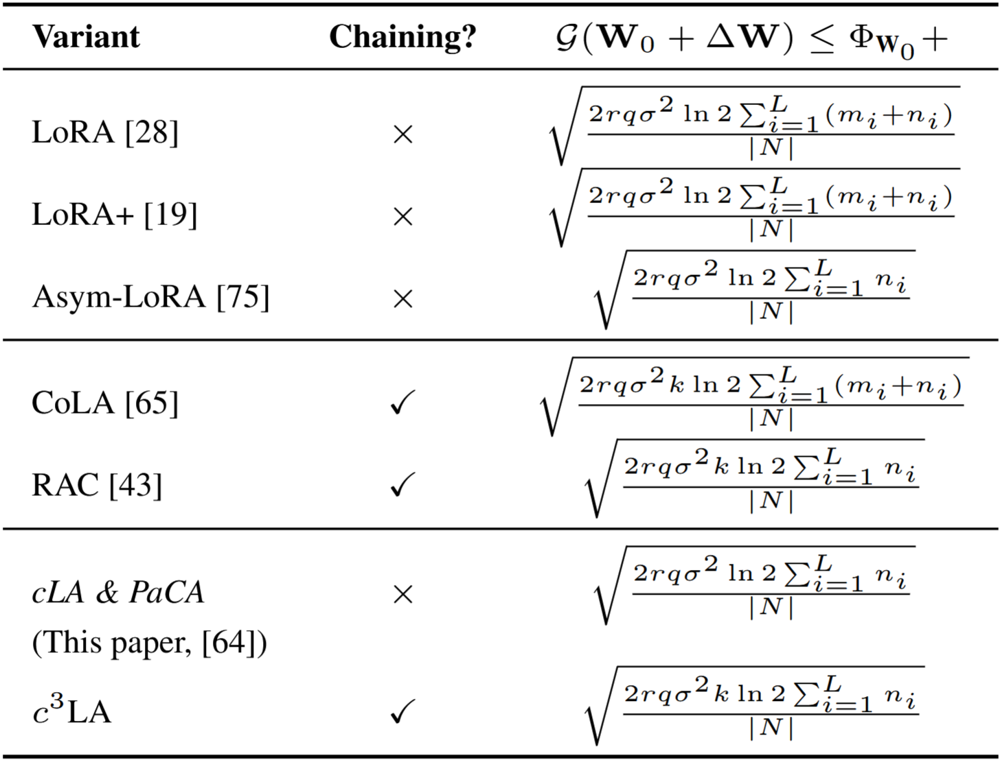
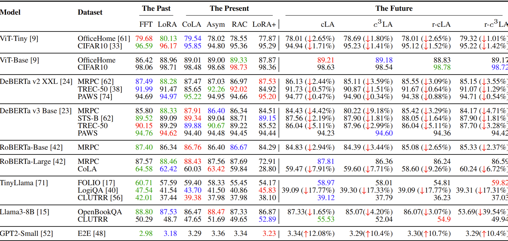
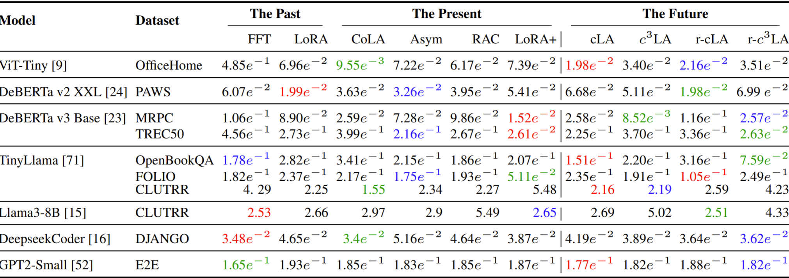
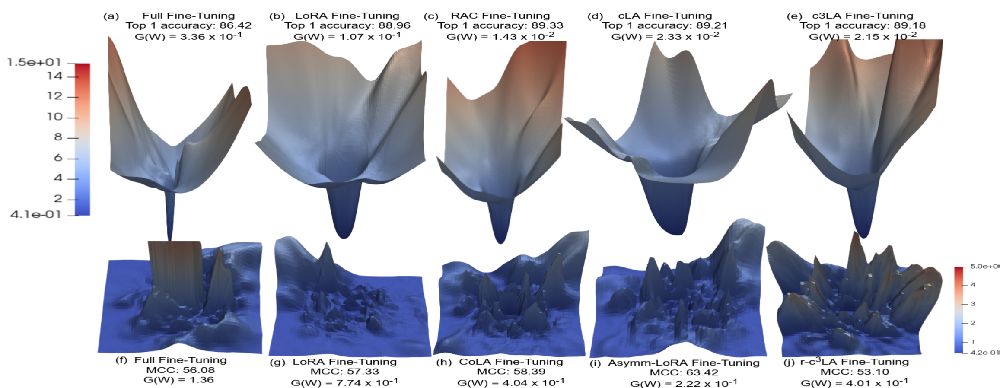
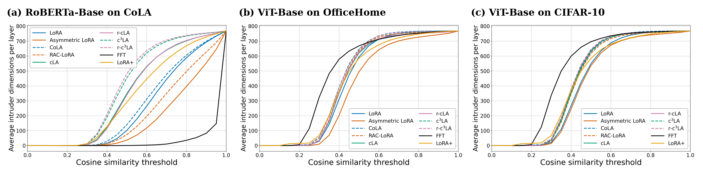

# Beyond LoRA: Is Sparsity-Induced Adaptation Better?

<p align="center">
  <a href="https://elicaden.github.io/Beyond_LoRA/">
    
  </a>
  <a href="https://arxiv.org/pdf/2606.13767">
    
  </a>
  <a href="https://arxiv.org/abs/2606.13767">
    
  </a>
  <a href="https://github.com/EliCaden/Beyond_LoRA">
    
  </a>
</p>

<p align="center">
  <a href="https://github.com/EliCaden">Elijah Cadenhead</a><sup>1</sup> ·
  <a href="https://github.com/nizswan">Cristian McGee</a><sup>1</sup> ·
  <a href="https://scholar.google.com/citations?user=6j5YOXMAAAAJ&hl=en&oi=ao">Xin Li</a><sup>1</sup> ·
  <a href="https://scholar.google.com/citations?user=qzxprWoAAAAJ&hl=en&oi=ao">El Houcine Bergou</a><sup>2</sup> ·
  <a href="https://scholar.google.com/citations?user=vquoiHsAAAAJ&hl=en&oi=ao">Aritra Dutta</a><sup>1</sup>
</p>

<p align="center">
  <sup>1</sup><a href="https://www.ucf.edu/">University of Central Florida</a> &nbsp;&nbsp;
  <sup>2</sup><a href="https://um6p.ma/en">Mohammed VI Polytechnic University</a>
</p>

<p align="center">
  <strong>Sparse, structured LoRA variants for cheaper and competitive parameter-efficient fine-tuning.</strong>
</p>

---

## Latest Updates

* **Jun 2026** — Paper released on arXiv: [Beyond LoRA: Is Sparsity-Induced Adaptation Better?](https://arxiv.org/abs/2606.13767).
* **Jun 2026** — Project page released: [elicaden.github.io/Beyond_LoRA](https://elicaden.github.io/Beyond_LoRA/).
* **Jun 2026** — Code for sparse LoRA variants, PaCA-style comparisons, generalization diagnostics, and benchmarking scripts released in this repository.

---

## Overview

Low-rank adaptation (LoRA) and its variants provide a memory- and compute-efficient alternative to full fine-tuning of pre-trained models. However, questions remain about the comparative generalizability of these approaches and how the structural restrictions on low-rank updates preserve effective adaptation performance.

We present a historical framing, covering the past — full fine-tuning and original LoRA — the present — different variants of LoRA — and propose simpler, cheaper, parameter-efficient extensions by inducing sparsity within existing LoRA variants: **Cheap LoRA** (`cLA`), training a single low-rank factor with the other fixed deterministically or stochastically, and the chained circulant variant, **c<sup>3</sup>LA**.

We frame `cLA` as a structured instance of asymmetric LoRA, serving as a controlled column-subspace restriction of full fine-tuning. We derive information-theoretic generalization error bounds for these variants and empirically evaluate **11 fine-tuning methods** across **10 pre-trained models and 14 datasets**, spanning language, vision, code generation, and logical reasoning.

Despite sensitivity to pre-trained models, datasets, and other factors, our results suggest that restricting LoRA-based PEFT methods' adaptation to a sparse, structured column space remains competitive with parameter-matched baselines while reducing up to **10% training time** and **15% peak GPU memory**, even with a naïve, non-optimized sparse implementation.

---

## Highlights

<p align="center">
  
</p>

**Main contributions:**

1. **Sparse LoRA variants.** We introduce `cLA`, `random-cLA`, `c³LA`, and `random-c³LA` as simple sparse extensions of state-of-the-art LoRA variants. These methods restrict adaptation to structured column subspaces, separating trainable parameter count from update geometry.

2. **Bridge to PaCA.** We show that sparsity-induced LoRA variants connect LoRA-style reparameterized fine-tuning with Partial Connection Adaptation (PaCA), giving a common lens for comparing adapter-based and partial-column fine-tuning methods.

3. **Information-theoretic generalization bounds.** We derive generalization upper bounds for LoRA-family updates by specializing a general neural-network theorem to different adapter structures. The resulting framework connects rank, chain length, layer dimensions, bitwidth, dataset size, and update support to fine-tuned model generalization.

4. **Benchmarking and evaluation.** We benchmark full fine-tuning, LoRA, modern LoRA variants, PaCA, and our sparse variants across 10 pretrained models and 14 datasets, reporting accuracy/perplexity/MCC, empirical generalization error, loss landscapes, intruder dimensions, throughput, runtime, and memory.

---

## Proposed Sparsity-Induced LoRA Variants

| Method        | High-level idea                                                                                                            |                                                                                      |
| ------------- | -------------------------------------------------------------------------------------------------------------------------- | ------------------------------------------------------------------------------------ |
| `cLA`         | Fix `A = [I_r                                                                                                              | 0]`and train only`B`, restricting adaptation to a deterministic `r`-column subspace. |
| `random-cLA`  | Randomize the fixed column selector while still training only `B`.                                                         |                                                                                      |
| `c³LA`        | Chain cLA modules and shift the identity block by `r` columns across chains, expanding coverage over the pretrained layer. |                                                                                      |
| `random-c³LA` | Combine randomized selectors with the chained cLA construction.                                                            |                                                                                      |

The sparse construction can be implemented without multiplying by the full fixed selector. For `cLA` and `random-cLA`, the selector matrix simply chooses `r` coordinates of the input. Instead of computing `A(x)` as a dense matrix multiplication, the implementation stores selected column indices and directly gathers the relevant input coordinates.

<p align="center">
  
</p>

---

## Theoretical Generalization Bounds

Theorem 1 is a general bound for an arbitrary fully connected `L`-layer neural network. It upper bounds the generalization error of the fine-tuned model `W₀ + ΔW` using the generalization behavior of either the pretrained backbone or the update. Once a PEFT method specifies the structure of `ΔW`, the theorem can be specialized to that method.

<p align="center">
  
</p>

With the additional assumption that the loss function `ℓ(·)` is `σ`-sub-Gaussian, we obtain upper bounds for the LoRA variants studied in this paper and for PaCA.

<p align="center">
  
</p>

The table shows that `cLA` and PaCA inherit the same generalization-order dependence, while `c³LA` inherits the chain-length dependence of chained LoRA variants.

---

## Benchmarking and Evaluation

We evaluate 11 fine-tuning methods across 10 pretrained models and 14 datasets. For CoLA we report Matthews correlation coefficient, for GPT2-small we report perplexity, and for the remaining datasets we report accuracy. We use green, red, and blue to indicate the best, second best, and third best result. For the sparse variants, ↓ indicates the accuracy drop percentage compared to the best.

<p align="center">
  
</p>

**Key takeaway.** No single method substantially outperforms the others across all downstream tasks. The sparsity-induced LoRA variants outperform FFT and LoRA in some tasks by a large margin, while in many cases their performance drop is modest. This suggests that fine-tuning methods should be selected based not only on accuracy, but also on runtime, memory, deployment constraints, and the user’s task-specific needs.

Although the sparse variants do not reduce the number of trainable parameters relative to their non-sparse LoRA counterparts, they reduce training time by **5–10%** and peak GPU memory by **5–15%** with a naïve, non-optimized sparse implementation.

---

## Empirical Generalization Error

We also report empirical generalization error, `𝒢(W)`, across the same model/dataset/method families. Lower values are better.

<p align="center">
  
</p>

Drawing a connection from the theoretical upper bounds, we find that PEFT methods with the same upper bounds often perform similarly in practice. For example, `cLA` has a smaller upper bound on `𝒢(W)` than `random-c³LA` in practice, matching the theory. This observation also holds for `cLA` and RAC, and `c³LA` and Asymmetric LoRA pairs. On the other hand, `cLA` and `random-cLA` have the same upper bound on `𝒢(W)`, and they also perform almost similarly in practice. Some discrepancies remain, which we attribute to the fact that Table 1 provides an upper bound rather than an exact prediction.

---

## Other Generalization Diagnostic Tools

### Loss Landscapes

3D loss landscapes visualize how a model’s empirical loss changes under small parameter perturbations. Sharper loss landscapes are often interpreted as indicating worse generalization, while smoother landscapes are often interpreted as indicating greater robustness to initialization.

<p align="center">
  
</p>

The top row shows loss landscapes of ViT-Base pretrained on ImageNet-21K and fine-tuned on OfficeHome. The bottom row shows loss landscapes of RoBERTa-Base pretrained on a large English corpus and fine-tuned on CoLA.

**Key takeaway.** The loss-landscape heuristic does not consistently align with empirical generalization in our experiments. Chain methods such as RAC-LoRA, CoLA, and `c³LA` often produce sharper landscapes than their non-chain counterparts, which would normally suggest worse generalization. However, this is not always what we observe empirically.

### Intruder Dimensions

Intruder dimensions compare pretrained and fine-tuned models through their singular-vector structure. Given the pretrained and fine-tuned models, `W₀` and `W₀ + ΔW`, the number of intruder dimensions is used as a diagnostic for how much the fine-tuned model has moved away from the pretrained representation.

<p align="center">
  
</p>

The figure reports the number of intruder dimensions present in FFT and various LoRA-based PEFT methods for RoBERTa-Base fine-tuned on CoLA and ViT-Base fine-tuned on OfficeHome and CIFAR-10 over varying threshold ranges, `ε ∈ (0, 1]`.

**Key takeaway.** The chain variant of any LoRA PEFT method produces more intruders than its non-chain counterpart; see LoRA compared to CoLA, Asymmetric LoRA to RAC, and `cLA` to `c³LA`. This correlates with our loss landscapes, where chain variants produce sharper landscapes. However, the expected worse generalizability of these chain methods is not observed empirically.

---

## Closing Takeaways

* PEFT performance is task-dependent: no single fine-tuning method dominates across all models and datasets.
* Our proposed sparse extensions of SOTA LoRA variants perform well across multiple modalities and models while substantially reducing training time and memory requirements.
* From a theoretical perspective, our sparsity-induced variants serve as a bridge between LoRA and PaCA, two different families of PEFT methods.
* Sparse variants may require larger budgets to maintain robustness in certain settings, but remain overall effective, highlighting the importance of selecting fine-tuning methods based on task characteristics and user constraints.
* The sparse methods have the same generalization error upper bounds as their non-sparse counterparts, and closely track empirical generalization trends across most models and modalities. This provides a more consistent and guided pathway for selecting PEFT methods, complementing diagnostics such as loss-landscape and intruder-dimension analyses.

---

# Repository and Implementation Guide

This repository contains the code accompanying the paper **"Beyond LoRA: Is Sparsity-Induced Adaptation Better?"** The paper studies full fine-tuning, LoRA, asymmetric LoRA, chain-style LoRA variants, cheaper/sparser LoRA variants, and related PEFT methods across language, vision, code, and reasoning tasks.

The repository is organized as two related codebases:

```text
Beyond_LoRA/
├── ProjectModelsOne/      # RoBERTa, GPT-2, ViT, LoRA/PaCA/sparse variants, and landscape tools
├── ProjectModelsTwo/      # Unified PEFT trainer suite for DeBERTa, TinyLlama, Llama-3, and DeepSeek-Coder
├── setup/                 # Environment setup helper
└── environment.template.yml
```

---

## Repository Contents

### `ProjectModelsOne/`

`ProjectModelsOne` contains the main training and analysis suite for RoBERTa, GPT-2, and ViT experiments. It includes standard full fine-tuning, LoRA, asymmetric LoRA, chain-style variants, sparse variants, PaCA variants, and loss-landscape / PCA analysis tooling.

```text
ProjectModelsOne/
├── analysis_tools/      # PCA directions, 2D/3D loss landscapes, plotting helpers
├── data/                # GLUE, E2E, CIFAR, OfficeHome, VTAB-style dataset loaders
├── methods/             # Full FT, LoRA q/v, head-only, LoRA-only, PaCA q/v methods
├── models/              # RoBERTa, GPT-2, ViT, LoRA layers/recipes, PaCA layers/recipes
├── scripts/             # Sweep entrypoints for text, vision, and E2E experiments
├── tasks/               # Task wrappers for causal LM, GLUE-style text, and image classification
├── trainers/            # Generic trainer and callbacks
├── utils/               # Adapter injection and target-module helpers
└── requirements.txt
```

Important entrypoints:

| Script                                | Purpose                                                |
| ------------------------------------- | ------------------------------------------------------ |
| `scripts/sweep_glue.py`               | RoBERTa-Base/Large experiments on GLUE-style tasks.    |
| `scripts/sweep_vision.py`             | ViT-Tiny/Base/Large/XXL experiments on image datasets. |
| `scripts/sweep_e2e.py`                | GPT-2 experiments on E2E natural language generation.  |
| `analysis_tools/weights_pca.py`       | PCA directions from checkpoint trajectories.           |
| `analysis_tools/plot_2d_with_path.py` | 2D loss landscapes with optimization paths.            |
| `analysis_tools/plot_3d_landscape.py` | 3D loss landscape visualizations.                      |

### `ProjectModelsTwo/`

`ProjectModelsTwo` contains a unified trainer suite for additional PEFT experiments on larger language/code/reasoning models.

```text
ProjectModelsTwo/
├── run.py                    # CLI dispatcher
├── deberta_trainer.py        # DeBERTa-v3-base and DeBERTa-v2-xxlarge experiments
├── deepseekcoder_trainer.py  # DeepSeek-Coder-1.3B experiments
├── tinyllama_trainer.py      # TinyLlama-1.1B experiments
├── llama3_trainer.py         # Llama-3-8B experiments
└── requirements.txt
```

Supported model families and datasets include:

| Model family   | Datasets/tasks                            |
| -------------- | ----------------------------------------- |
| DeBERTa        | `mrpc`, `rte`, `sts-b`, `trec50`, `paws`  |
| TinyLlama      | `openbookqa`, `folio`, `logiqa`, `clutrr` |
| Llama-3        | `openbookqa`, `clutrr`                    |
| DeepSeek-Coder | `django`                                  |

---

## Methods

The code covers the PEFT method families studied in the paper. Naming differs slightly between the two project folders, but the major method families are:

| Family             | Common CLI names                                          | Description                                                                       |
| ------------------ | --------------------------------------------------------- | --------------------------------------------------------------------------------- |
| Full fine-tuning   | `full`, `fft`, `ft`                                       | Train all model parameters.                                                       |
| Head-only          | `head`, `heads`, `head_only`                              | Train only the task-specific head.                                                |
| LoRA               | `lora`, `base`, `vanilla`                                 | Standard low-rank adaptation.                                                     |
| Asymmetric LoRA    | `asym_a`, `asym_b`, `fixa`                                | Freeze one low-rank factor and train the other.                                   |
| Cheap LoRA / cLA   | `cheap`, `cla`                                            | Fixed structured low-rank factor; train the other factor.                         |
| Random cLA         | `random_cheap`, `rcla`, `random`                          | Randomized fixed-factor variant.                                                  |
| Chain LoRA / CoLA  | `cola`, `chain`                                           | Merge the current low-rank update into the base model and reinitialize adapters.  |
| RAC                | `rac`, `rac_a`, `rac_b`                                   | Chain-style merge/reinitialize variant with randomized resets.                    |
| c3LA               | `c3la`, `modest`                                          | Chained/sliding structured factor variant.                                        |
| Shuffled c3LA      | `shuffle`, `rc3la`                                        | Sliding-window chain variant with random shuffling.                               |
| LoRA+              | `lora_plus`, `lora+`, `plus`                              | LoRA with different learning rates for the two factors.                           |
| Sparse variants    | `sparse_cheap`, `sparse_shuffle`, `sparse_c3la`           | Sparse versions of structured LoRA variants.                                      |
| BA-sparse variants | `ba_sparse_lora`, `ba_sparse_final`, `ba_sparse_fix_mask` | Mask the effective `BA` update during training, at the end, or with a fixed mask. |
| PaCA variants      | `paca`, `dpaca`, `cpaca`, `dcpaca`                        | Partial connection adaptation variants.                                           |

---

## Environment Setup

A lightweight conda environment template is provided at the repository root.

```bash
conda env create -f environment.template.yml
conda activate beyond_lora
```

Then install the project-specific requirements for the codebase you plan to run:

```bash
pip install -r ProjectModelsOne/requirements.txt
pip install -r ProjectModelsTwo/requirements.txt
```

Alternatively, use the helper script:

```bash
bash setup/create_beyond_lora_env.sh environment.template.yml beyond_lora
conda activate beyond_lora
```

For GPU experiments, make sure the installed PyTorch/CUDA versions match the target machine or cluster. The template is intended as a reproducible starting point rather than a machine-specific lockfile.

---

## Reproducing Representative Experiments from `ProjectModelsOne`

Run these commands from inside `ProjectModelsOne`:

```bash
cd ProjectModelsOne
```

The paper uses rank `r=16` and scaling factor `alpha=32` for LoRA-style PEFT methods in the representative settings. Full fine-tuning uses a separate learning rate and weight decay.

### RoBERTa-Base / RoBERTa-Large on MRPC and CoLA

```bash
# RoBERTa-Base full fine-tuning
python -m scripts.sweep_glue \
  --tasks mrpc cola \
  --variant base \
  --methods full \
  --seeds 12 22 32 \
  --lrs 1e-5 \
  --batch-size 32 \
  --epochs 20 \
  --max-length 128 \
  --scheduler linear \
  --min-lr 1e-6 \
  --warmup-ratio 0.1 \
  --weight-decay-full 0.01 \
  --out-dir runs/roberta_base_table7_full

# RoBERTa-Base PEFT methods
python -m scripts.sweep_glue \
  --tasks mrpc cola \
  --variant base \
  --methods lora asym_a asym_b cheap random_cheap cola rac_a rac_b c3la shuffle lora_plus sparse_cheap sparse_shuffle sparse_c3la ba_sparse_lora ba_sparse_final ba_sparse_fix_mask paca dpaca cpaca dcpaca \
  --seeds 12 22 32 \
  --lrs 3e-4 \
  --ranks 16 \
  --alphas 32 \
  --chain-every-epochs 3 \
  --batch-size 32 \
  --epochs 20 \
  --max-length 128 \
  --scheduler linear \
  --min-lr 1e-6 \
  --warmup-ratio 0.1 \
  --weight-decay-lora 0 \
  --out-dir runs/roberta_base_table7_peft
```

For RoBERTa-Large, change `--variant base` to `--variant large` and update the output directory.

### GPT-2 on E2E

```bash
# GPT-2 full fine-tuning
python -m scripts.sweep_e2e \
  --dataset e2e \
  --backbone gpt2 \
  --methods full \
  --seeds 12 22 32 \
  --lr-full 5e-5 \
  --epochs 30 \
  --batch-size 16 \
  --max-length 64 \
  --chain-every-epochs 1 \
  --out-dir runs/gpt2_e2e_table7_full

# GPT-2 PEFT methods
python -m scripts.sweep_e2e \
  --dataset e2e \
  --backbone gpt2 \
  --methods lora asym_a asym_b cheap random_cheap cola rac_a rac_b c3la shuffle lora_plus sparse_cheap sparse_shuffle sparse_c3la ba_sparse_lora ba_sparse_final \
  --seeds 12 22 32 \
  --lr-others 3e-4 \
  --ranks 16 \
  --alphas 32 \
  --epochs 30 \
  --batch-size 16 \
  --max-length 64 \
  --chain-every-epochs 1 \
  --out-dir runs/gpt2_e2e_table7_peft
```

### ViT-Tiny / ViT-Base on OfficeHome and CIFAR-10

```bash
# ViT-Tiny full fine-tuning
python -m scripts.sweep_vision \
  --datasets officehome cifar10 \
  --vit-variant tiny \
  --methods full \
  --seeds 12 22 32 \
  --lr-full 3e-4 \
  --batch-size 64 \
  --epochs 30 \
  --img-size 224 \
  --scheduler cosine \
  --min-lr 1e-6 \
  --warmup-ratio 0.05 \
  --weight-decay-full 0.05 \
  --out-dir runs/vit_tiny_table7_full

# ViT-Tiny PEFT methods
python -m scripts.sweep_vision \
  --datasets officehome cifar10 \
  --vit-variant tiny \
  --methods lora asym_a asym_b cheap random_cheap cola rac_a rac_b c3la shuffle lora_plus sparse_cheap sparse_shuffle sparse_c3la ba_sparse_lora ba_sparse_final ba_sparse_fix_mask paca dpaca cpaca dcpaca \
  --seeds 12 22 32 \
  --lr-others 1e-3 \
  --ranks 16 \
  --alphas 32 \
  --chain-every-epochs 5 \
  --batch-size 64 \
  --epochs 30 \
  --img-size 224 \
  --scheduler cosine \
  --min-lr 1e-6 \
  --warmup-ratio 0.05 \
  --weight-decay-lora 0 \
  --out-dir runs/vit_tiny_table7_peft
```

For ViT-Base, change `--vit-variant tiny` to `--vit-variant base` and update the output directory.

---

## Running `ProjectModelsTwo`

Run these commands from inside `ProjectModelsTwo`:

```bash
cd ProjectModelsTwo
```

Basic CLI examples:

```bash
python run.py
python run.py deberta lora mrpc
python run.py tinyllama chain clutrr epochs=10 chainReset=2 rank=16
python run.py llama3 plus openbookqa lr_ratio=32 learningRate=2e-5
python run.py deepseek fft django maxLength=2048 batchSize=2
```

Programmatic sweep example:

```python
#!/usr/bin/env python3
import tinyllama_trainer as TinyLlama

for method in ("rac", "chain", "c3la", "rc3la"):
    for seed in (100, 101, 102):
        TinyLlama.Run(
            model="tinyllama",
            dataset="logiqa",
            method=method,
            maxLength=512,
            batchSize=8,
            learningRate=1e-3,
            epochs=10,
            chainReset=2,
            rank=16,
            alpha=32,
            seed=seed,
        )
```

The `Run(...)` API accepts:

```python
Run(
    model, dataset, method,
    maxLength, batchSize, learningRate, epochs,
    chainReset,   # chain, rac, c3la, rc3la
    rank, alpha,  # alpha=0 sets alpha to 2 * rank
    lr_ratio,     # LoRA+ only
    seed,
)
```

Notes:

* `chainReset` is count-based: `chainReset=2` means two resets total, spread across training.
* `alpha=0` automatically sets `alpha = 2 * rank`.
* Unused hyperparameters for a method are accepted for sweep parity and ignored.
* `rte`, `sst2`, and `stsb` print train/validation metrics only when public test labels are unavailable. STS-B reports Pearson correlation in the accuracy slot.

---

## Weights & Biases Logging

For scripts that support WandB logging, add:

```bash
--wandb --wandb-project beyond-lora --wandb-group table7 --wandb-mode online
```

For offline or restricted cluster runs, use:

```bash
--wandb --wandb-project beyond-lora --wandb-group table7 --wandb-mode offline
```

---

## Outputs

`ProjectModelsOne` sweep scripts write JSONL summaries under the selected `--out-dir`, together with checkpoints unless checkpoint-saving options are disabled. Useful flags for large sweeps include:

```bash
--dry-run
--resume
--overwrite
--save-best-only
--save-json-only
```

`ProjectModelsTwo` trainers print epoch-level train/validation/test metrics in the terminal.

---

## Citation

If this repository is useful for your work, please cite the accompanying paper:

```bibtex
@article{cadenhead2026beyondlora,
  title={Beyond LoRA: Is Sparsity-Induced Adaptation Better?},
  author={Cadenhead, Elijah and McGee, Cristian and Li, Xin and Bergou, El Houcine and Dutta, Aritra},
  journal={arXiv preprint arXiv:2606.13767},
  year={2026}
}
```
